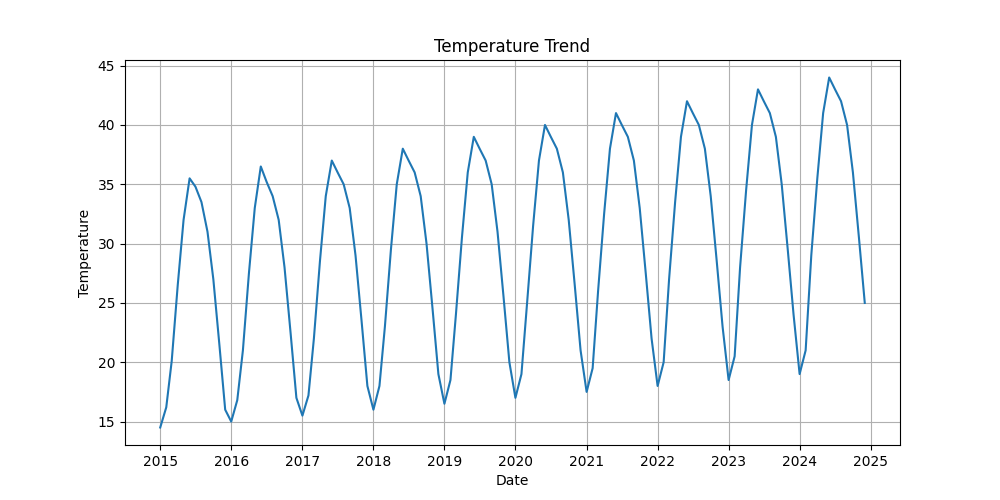
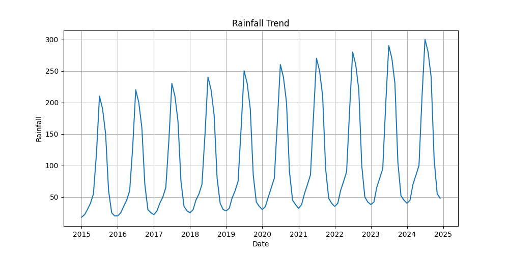
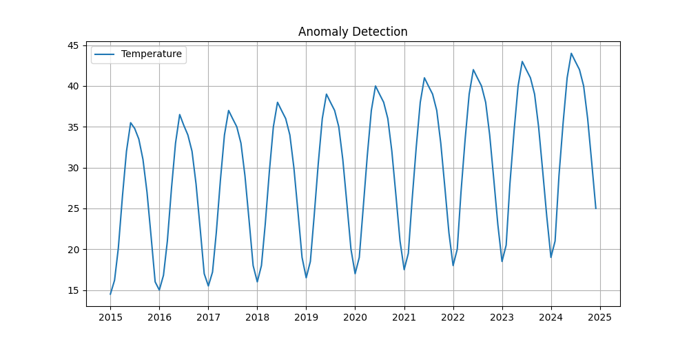
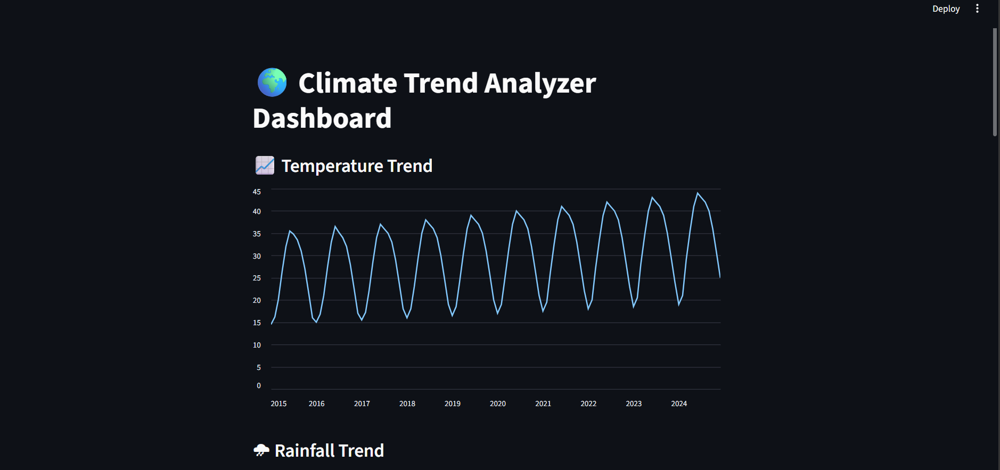
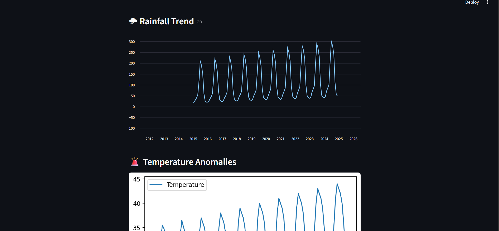
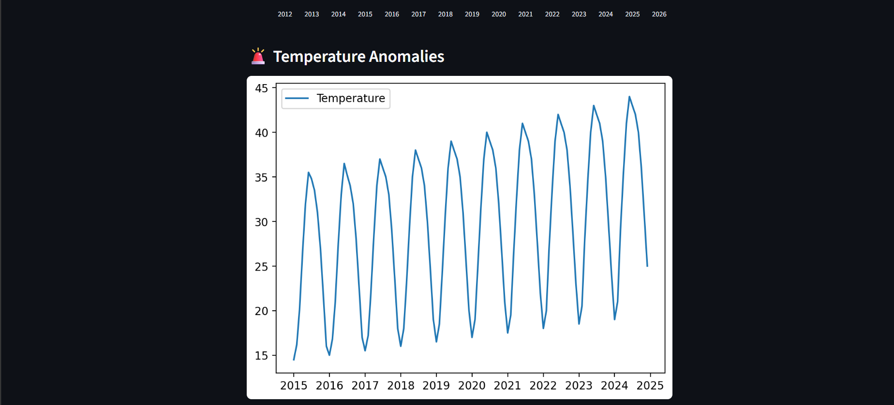
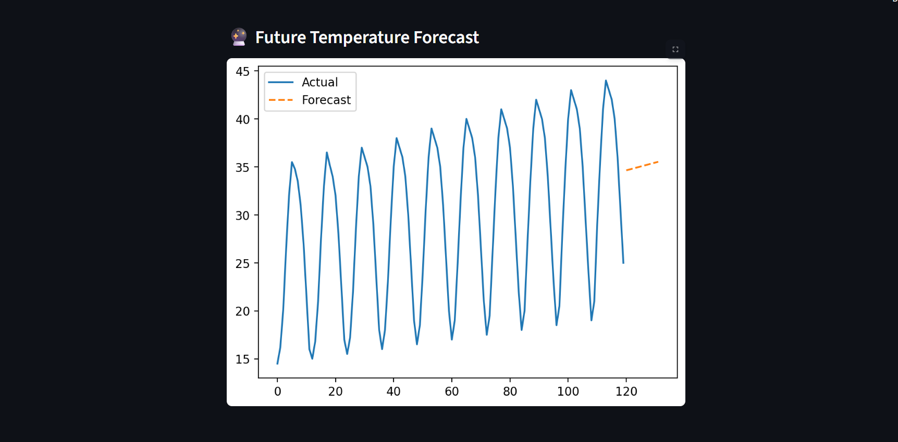

# 🌍 Climate Trend Analyzer

---

## 📌 Project Overview

The **Climate Trend Analyzer** is a data science project that analyzes historical climate data to identify:

- 🌡 Temperature trends
- 🌧 Rainfall patterns
- 🚨 Climate anomalies
- 🔮 Future predictions

This project simulates real-world climate analytics used by environmental agencies and data scientists.

---

## 🎯 Problem Statement

Climate change is a critical global issue. Understanding long-term trends and anomalies helps in:

- Policy making
- Agriculture planning
- Disaster management
- Environmental research

---

## 🧠 Key Features

✔ Data Cleaning & Preprocessing  
✔ Exploratory Data Analysis (EDA)  
✔ Trend Analysis (Time-Series)  
✔ Anomaly Detection  
✔ Forecasting (Linear Regression)  
✔ Interactive Dashboard (Streamlit)  

---

## 🛠 Tech Stack

- Python
- Pandas, NumPy
- Matplotlib
- Scikit-learn
- Streamlit

---

## 📂 Project Structure
Climate-Trend-Analyzer/
│
├── data/
├── src/
├── outputs/
├── app/
├── main.py
├── requirements.txt

---

## 📊 Results & Visualizations

### 🌡 Temperature Trend

### 🌧 Rainfall Trend

### 🚨 Anomaly Detection

### 📊 Dashboard

---

## 🔮 Forecasting

The project uses **Linear Regression** to predict future temperature trends based on historical data.

---

## ▶️ How to Run

bash
pip install -r requirements.txt
python main.py
Run Dashboard
streamlit run app/app.py
📈 Business / Industry Relevance
Climate Risk Analysis
Agriculture Forecasting
Energy Demand Prediction
Environmental Monitoring
🚀 Future Improvements
ARIMA / LSTM forecasting
CO₂ & pollution data integration
Multi-city climate comparison
Live API integration
📚 Learning Outcomes
Time Series Analysis
Data Visualization
Machine Learning Basics
Real-world Data Handling
👩‍💻 Author

Sanskritika Awasthi